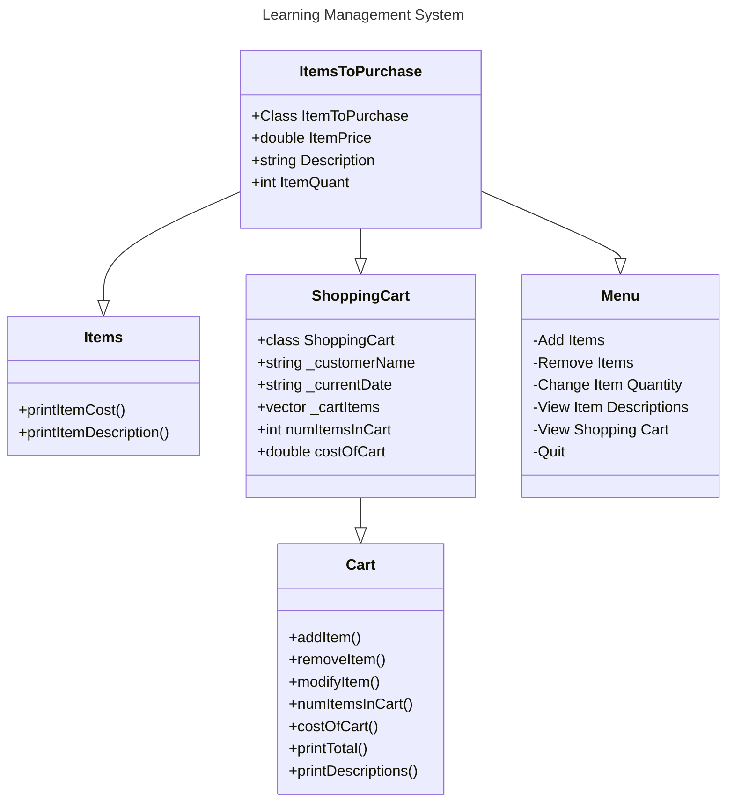

## Shopping Cart Program (By Connor)
This application was built to assist shoppers and provide them with a Usable interface to get groceries. It gives users the ability to:
- Add & Remove items to & from their carts
- Modify the quantity of each item they get
- Look at the descriptions of the items they want to purchase
- View the items in their shopping cart

| Screen | Description |
| -------| ----------- |
| Main Menu | Gives a brief overview of the rest of the menus, allows for navigation to the rest of the menus |
| Courses | Faculty can see the courses they are teaching and drill down & reach student roster through this menu |
| Class Roster | Shows the class roster for each of the classes they are teaching and can manage individual students |
| Student Management | Faculty is able to see student progress and manage their grades, etc. |

You can learn more about Learning Management Systems and their benefits here: [link](https://wahoolearning.com/blog/learning-management-systems/benefits-customised-lms/) 


``` 
Class Diagram
```

This is an example of a more sophisticated LMS Class Diagram: 
