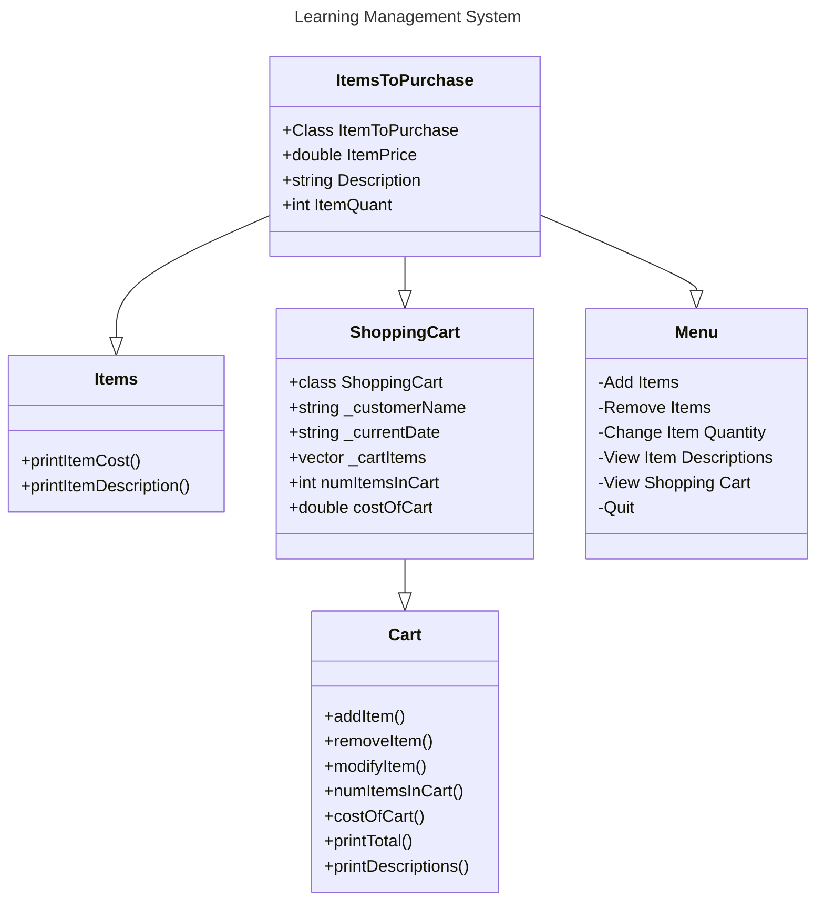

## Shopping Cart Program (By Connor)
This application was built to assist shoppers and provide them with a Usable interface to get groceries. It gives users the ability to:
- Add & Remove items to & from their carts
- Modify the quantity of each item they get
- Look at the descriptions of the items they want to purchase
- View the items in their shopping cart

| Option | Description |
| -------| ----------- |
| Add Items | Allows the customer to add whatever number of whatever item that they would like |
| Remove Items | Allows the customer to remove any items from their cart |
| Change Item Quantity | Allows the customer to modify the quantity of any given item in their cart |
| See Item Descriptions| Enables the customer to go and make sure they specified all the right details about the items they want |
| View Shopping Cart| Allows the customer to see all the items in their cart and the total price of them |
| Quit | In the case that the customer decides they dont need anything, they are able to quit out of the application |


``` 
Class Diagram
```

```
App Demo
```
I created an App Demo on Microsoft Teams and have shared access to the recording with you.

